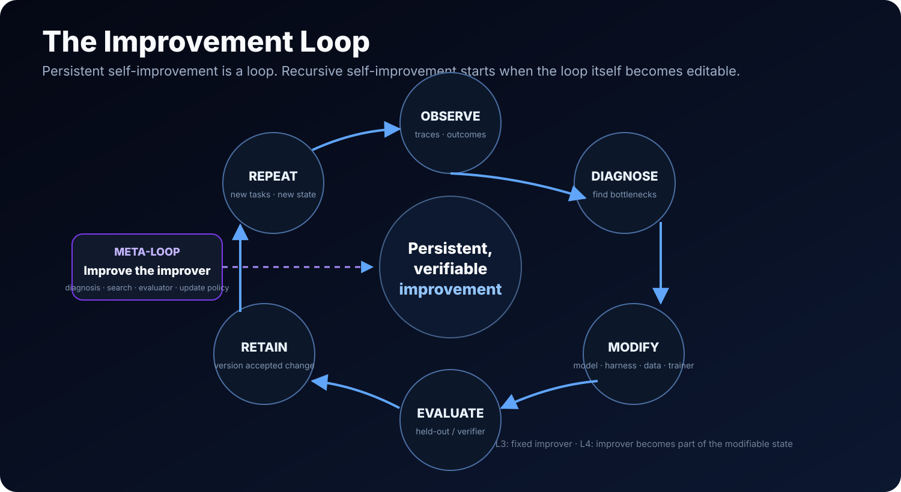

# RSI Landscape

> **A field map, not a hype ladder.** The Observatory uses independent axes for improvement scope, recursive depth, and evidence.

[← Observatory](README.md) · [Methodology](METHODOLOGY.md) · [Scorecard](SCORECARD.md) · [Research](PAPERS.md)

## The core model

A useful current abstraction is an evolving system state:

`x_t = (Model, Harness, Data, Trainer, Improvement Mechanism)`

An improvement loop diagnoses the current system, proposes candidate changes, evaluates/selects them, and integrates accepted changes. **Recursive self-improvement begins when that improvement mechanism is itself part of the modifiable state.**

## Axis A — improvement scope

### Model
Weights, policy and learned behavior.

Examples: self-training, self-reward, test-time training, policy improvement, AI-generated supervision.

### Harness
Prompts, tools, workflows, code, orchestration, context engineering and runtime scaffolding.

Examples: AutoHarness, Agentic Harness Engineering, Gödel Agent, Darwin Gödel Machine, self-modifying coding agents.

### Data system
Experience memory, task generation, trajectories, skill libraries, retrieval/update rules and environment generation.

Examples: Reflexion, A-MEM, Recuris, skill evolution, task synthesis.

### Trainer
Reward/verifier design, training code, optimization policy, post-training recipe and infrastructure.

Examples: EvoLM, FT-Dojo, MLEvolve, reward/rubric evolution.

### Improvement mechanism
The machinery that decides **how future improvements are generated**: diagnosis, search policy, proposal generator, evaluator selection and integration strategy.

This is the key L3→L4 boundary. Examples classified L4 in the 2026 survey include Gödel Agent and Darwin Gödel Machine; meta-loop trainer work includes AutoScientists and Bilevel Autoresearch.

### Cross-component co-improvement
Model + harness, harness + data, data + trainer, or larger coupled systems.

This matters because system bottlenecks move: improving one component can expose the next constraint.

## Axis B — recursive depth

| Level | Category | What the system can do |
|---|---|---|
| **L1** | Manual improvement | Fixed deployed system; humans implement changes. |
| **L2** | Assisted improvement | AI diagnoses/proposes; humans validate or apply substantive changes. |
| **L3** | Programmatic self-improvement | AI proposes, applies and validates persistent component changes; improver remains fixed. |
| **L4** | Bounded RSI | Improvement mechanism itself is modifiable in a bounded domain. |
| **L5** | General RSI | L4-style self-reference transfers across broad evolving domains. |

## Axis C — evidence

See [Methodology](METHODOLOGY.md) for E0–E5. The most useful operational distinction is that **a closed loop is not enough**. A closed research workflow can exist without the workflow learning how to improve its own future improvement process.

## Domain overlays

Domains are **filters**, not higher levels:

### Coding / software engineering
Source code is unusually attractive for RSI experiments because modifications and evaluators can be executable. DGM, Gödel Agent and self-improving coding agents live here.

### Automated AI R&D
AI Scientist, OpenRSI/OpenMLE, FT-Dojo, AutoResearch and MLEvolve automate increasingly large parts of research. The RSI question is whether the **research-improvement mechanism itself** becomes a durable, modifiable object.

### Personal / long-running agents
Memory, skills and routines create persistent state across episodes. Recuris, KnowAct and related systems explore this layer.

### Embodied systems
Robot policies, world models, skills and code evolve through real/simulated interaction. Examples include ASPIRE, ENPIRE, MineEvolve and RISE.

### Multi-agent systems
Populations, role structures, debate, curriculum agents and co-evolving policies can create persistent system-level change. Debate alone is not RSI unless future system state changes.

## A practical placement rule

For a new project, record this tuple:

`(scope, L-depth, E-evidence, domain-tags)`

Examples:

- **Darwin Gödel Machine** → `(Harness/code, L4, E4, coding)`
- **Reflexion** → `(Data/memory, L3, E3, general agents)`
- **AI Scientist** → `(Research process, not RSI-scored, E3, automated AI R&D)`
- **LightRSI** → `(Harness/runtime, substrate, E1, long-horizon agents)`

This format is intentionally less dramatic than a single “progress ladder”, but it makes comparisons much harder to game.
