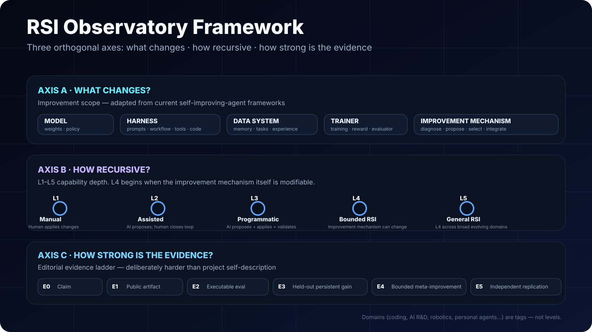

# Methodology

> **The Observatory separates scope, recursive depth, and evidence.** This prevents a common category error: treating “what the system changes” as if it were the same thing as “how recursively it improves.”

[← Observatory](README.md) · [Landscape](LANDSCAPE.md) · [Scorecard](SCORECARD.md) · [Research](PAPERS.md)

## 1. Axis A — what changes?

The primary system-state decomposition follows the 2026 survey **The Path to Recursive Self-Improving Agents**:

- **Model (M)** — weights, policy, model behavior.
- **Harness (H)** — prompts, workflows, tools, code, orchestration and runtime scaffolding.
- **Data system (D)** — memory, experience, task generation, trajectories and reusable data.
- **Trainer (T)** — training recipe, reward, verifier/evaluator, infrastructure and optimization process.
- **Improvement mechanism (Imp)** — the process that diagnoses bottlenecks, proposes modifications, evaluates/selects them and integrates accepted changes.
- **Cross-component co-improvement** — two or more of the above evolve together.

A second 2026 survey, **Recursive Self-Improvement in AI: From Bounded Self-Refinement to Autonomous Research Loops**, independently argues for separating **what is improved** from **degree of loop closure**. This is why the Observatory does not treat “memory evolution”, “coding agent”, and “automated AI R&D” as rungs on one ladder.

## 2. Axis B — how recursive?

We use the L1–L5 depth vocabulary from *The Path to Recursive Self-Improving Agents* when an external grade exists or when public evidence is sufficient to map conservatively:

| Level | Meaning | Critical boundary |
|---|---|---|
| **L1 — Manual improvement** | Humans make substantive changes. | No autonomous improvement loop. |
| **L2 — Assisted improvement** | AI proposes or diagnoses; humans validate/apply substantive changes. | Human still closes the loop. |
| **L3 — Programmatic self-improvement** | AI can propose, apply and validate persistent changes to operational components. | **Improvement mechanism remains fixed or externally maintained.** |
| **L4 — Bounded RSI** | L3 plus the improvement mechanism itself can be modified. | **The improver becomes part of the modifiable state.** |
| **L5 — General RSI** | L4 behavior transfers across broad, evolving domains. | Generality beyond a fixed bounded domain. |

**RSI Observatory rule:** do not call an L3-style self-improving system “Direct RSI” merely because it is impressive or autonomous.

## 3. Axis C — how strong is the evidence?

The E0–E5 ladder is an **RSI Observatory editorial standard**, not a community consensus metric.

| Evidence | Minimum bar |
|---|---|
| **E0 — Claim** | A project/paper says the system self-improves. |
| **E1 — Public artifact** | Code, weights, traces, or a detailed implementation artifact is public. |
| **E2 — Executable evaluation** | The system can be run against an objective or externally checkable evaluator. |
| **E3 — Held-out persistent gain** | Accepted changes improve later/held-out work, not only the optimization episode. |
| **E4 — Bounded meta-improvement** | Public evidence shows the improvement mechanism itself changing inside a bounded loop. |
| **E5 — Independent replication** | Independent multi-generation reproduction of the recursive gain. |

No system is promoted because of Stars, marketing language, or naming alone.

## 4. Roles used by the Observatory

| Role | Meaning |
|---|---|
| **Direct RSI** | Public evidence supports an L4-like bounded recursive loop: the improver/update mechanism is itself modifiable. |
| **RSI-directed meta-evolution** | The project explicitly targets recursive/meta-improvement and shows bounded meta-evolution, but broader recursive claims remain intentionally limited. |
| **Self-improving system** | Persistent autonomous improvement is central, typically L3/L3-like, without demonstrated mutable improvement mechanism. |
| **RSI substrate** | Runtime/harness/environment that enables RSI experiments; capability must be scored on an instantiated loop. |
| **Enabling** | A component such as memory, skill, verification, or optimization that can support RSI. |
| **Adjacent AI R&D** | Highly relevant automated research or AI-for-AI system, but not itself demonstrated as recursively self-improving. |
| **Foundational** | Theory, survey, or historical work used to define the field. |

## 5. Domains are tags, not levels

`coding` · `AI R&D` · `personal agents` · `robotics` · `multi-agent` · `general agents`

A system can be advanced in a domain without being more recursive. **AI Scientist** is a useful example: closed-loop automated research is important upstream of RSI, but a research workflow is not automatically a self-modifying improvement mechanism.

## 6. Classification checklist

For every scored system, ask:

1. What exact state changes?
2. Does the accepted change persist into later work?
3. Who proposes modifications?
4. Who validates/selects them?
5. Can the evaluator be tampered with by the system being improved?
6. Is the improvement mechanism itself modifiable?
7. Do gains transfer beyond the optimization set?
8. Is the gain reproducible from a clean run?
9. Are modifications bounded, inspectable and reversible?
10. Is the result a better system, or mostly more inference/search compute?

## 7. Disputes are expected

This field is moving quickly and some labels are judgments under incomplete evidence. A classification should therefore include:

- source / paper / implementation;
- the exact disputed field;
- proposed replacement;
- evidence for the change;
- whether the evidence is author-reported or independently reproduced.

Use the **classification correction** Issue template. The default policy is **under-claim rather than inflate**.

## References used to define the framework

- [The Path to Recursive Self-Improving Agents: Foundation, Framework, and Future Directions](https://www.preprints.org/manuscript/202608.0051)
- [Living survey repository](https://github.com/D2I-ai/awesome-recursive-self-improving-agents)
- [Recursive Self-Improvement in AI: From Bounded Self-Refinement to Autonomous Research Loops](https://arxiv.org/abs/2607.07663)
