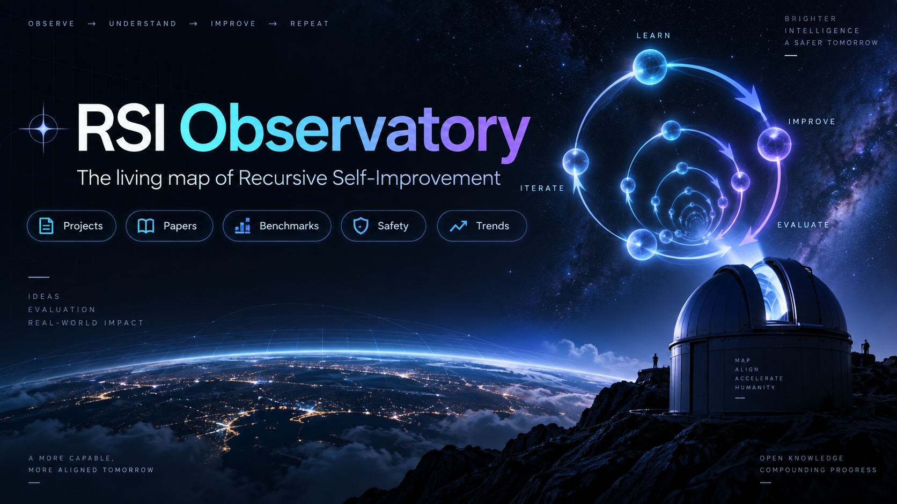

  

  
  
  
  

<strong>Projects · Research · Benchmarks · Evidence · Safety · Labs · Timeline · Trends</strong>

> **RSI Observatory is an opinionated, evidence-driven living map of Recursive Self-Improvement.** It is built to answer three questions: **what is changing, how recursive is it, and how strong is the public evidence?**

**RSI = Recursive Self-Improvement**, not the trading Relative Strength Index.

**[Open the live website →](https://fucheng1245.github.io/RSI-Observatory/)**

**New here? [Take the five-minute tour →](START_HERE.md)**

---

## Why this exists

The field is growing fast, but the vocabulary is messy. “Self-refine”, “self-evolve”, “self-improving agent”, “AI researcher” and “RSI” are often used for systems with very different capabilities.

The Observatory does **not** solve that by making a bigger link dump. It adds an evidence layer:

<table>
<tr><td width="33%" valign="top"><h3>🗺️ Map</h3>
Organize work by <b>what changes</b>: model, harness, data, trainer, improvement mechanism.

<a href="LANDSCAPE.md"><b>Explore the landscape →</b></a>
</td>
<td width="33%" valign="top"><h3>🧬 Judge</h3>
Separate L3 persistent self-improvement from L4 bounded RSI instead of trusting project names.

<a href="SCORECARD.md"><b>Open the scorecard →</b></a>
</td>
<td width="33%" valign="top"><h3>🔥 Track</h3>
Watch projects, fresh papers, benchmarks and weekly movement instead of freezing the field in time.

<a href="radar/LATEST.md"><b>Read the Radar →</b></a>
</td></tr>
</table>

---

## The method in one screen

**Axis A — what changes?** `Model · Harness · Data · Trainer · Improvement Mechanism`

**Axis B — how recursive?** `L1 Manual → L2 Assisted → L3 Programmatic Self-Improvement → L4 Bounded RSI → L5 General RSI`

**Axis C — how strong is the evidence?** `E0 Claim → E1 Artifact → E2 Executable Eval → E3 Persistent Held-out Gain → E4 Meta-Improvement → E5 Independent Replication`

> **Key boundary:** L4 begins when the **improvement mechanism itself** becomes modifiable. Automated research, persistent memory, or a closed loop can all be important without crossing that boundary.

[Read the full methodology →](METHODOLOGY.md)

---

## Scorecard snapshot

| System | Role | Scope | Depth | Improver mutable? | Evidence |
|---|---|---|---|---|---|
| [Darwin Gödel Machine](https://github.com/jennyzzt/dgm) | Direct RSI | Harness / agent source code | L4 | yes | E4 |
| [Gödel Agent](https://github.com/Arvid-pku/Godel_Agent) | Direct RSI | Harness / agent code | L4 | yes | E4 |
| [OpenRSI / OpenMLE](https://github.com/FrontisAI/OpenRSI) | RSI-directed meta-evolution | Model + harness + trainer | L4-like framing; recursion unverified | trained improver; autonomous meta-loop unverified | E3 |
| [Recuris](https://github.com/Gen-Verse/Recuris) | Self-improving system | Data system / memory + harness | L3 | not demonstrated | E3 |
| [Prime Agent](https://github.com/PrimeIntellect-ai/prime-agent) | Self-improving system | Harness / skills / coding workflow | L3-like | not demonstrated | E1 |
| [KnowAct](https://github.com/HITsz-TMG/KnowAct) | Self-improving system | Data system + harness | L3-like | not demonstrated | E2 |
| [Reflexion](https://arxiv.org/abs/2303.11366) | Enabling / self-improving memory | Data system / memory | L3 | no | E2 |
| [The AI Scientist](https://github.com/SakanaAI/AI-Scientist) | Adjacent AI R&D | Research process | Not RSI-scored | no | E2 |
| [LightRSI](https://github.com/zjunlp/LightRSI) | RSI substrate | Harness / runtime | N/A (substrate) | score instantiated loop | E1 |

**Why this is conservative:** the 2026 *Path to Recursive Self-Improving Agents* survey grades **Gödel Agent** and **Darwin Gödel Machine** L4. OpenRSI describes its current starting point as bounded **Meta-Evolution — training the improver itself — while explicitly not claiming general RSI is solved**. Other self-improving systems stay L3/L3-like here until comparable public evidence appears.

Author-reported evidence; no independent reproduction by this Observatory. [Review scope and corrections](SOURCE_REVIEW.md).

[Full scorecard + rationale →](SCORECARD.md)

---

## The improvement loop

A useful mental model is:

`Observe → Diagnose → Modify → Evaluate → Retain → Repeat`

At L3, that loop can improve persistent system components. At L4, the **meta-loop** can also change how diagnosis, proposal, evaluation or integration will work in future rounds.

---

## Research Library

The curated library contains **213 works** with separate relevance labels:

- **Core** — persistent self-improvement, self-modification, or recursive/meta-improvement is central. **Core does not automatically mean L4 RSI.**
- **Enabling** — memory, verification, tooling, optimization and other mechanisms useful to self-improvement.
- **Adjacent** — automated AI R&D, evaluation, open-ended search and safety work that materially informs RSI.
- **Foundational** — theory, surveys and historical work.

The website exposes the index as a searchable library; [`data/paper-index.json`](data/paper-index.json) is machine-readable.

[Browse the 213-work Research Library →](PAPERS.md)

---

## Featured systems by role

<table>
<tr><td width="50%" valign="top"><h3>🧬 Direct RSI</h3>
<b><a href="https://github.com/jennyzzt/dgm">Darwin Gödel Machine</a></b> — L4 in the 2026 survey; evolves agent code and retains validated variants.

<b><a href="https://github.com/Arvid-pku/Godel_Agent">Gödel Agent</a></b> — L4 in the same survey; self-referential agent logic.
</td>
<td width="50%" valign="top"><h3>🧪 RSI-directed</h3>
<b><a href="https://github.com/FrontisAI/OpenRSI">OpenRSI / OpenMLE</a></b> — executable AI4AI and bounded meta-evolution; explicitly framed as progress toward RSI rather than a claim that general RSI is solved.
</td></tr>
<tr><td width="50%" valign="top"><h3>🧠 Self-improving systems</h3>
<b><a href="https://github.com/Gen-Verse/Recuris">Recuris</a></b> — persistent experiential/working-memory evolution.

<b><a href="https://github.com/PrimeIntellect-ai/prime-agent">Prime Agent</a></b> — long-running self-improving coding agent.

<b><a href="https://github.com/HITsz-TMG/KnowAct">KnowAct</a></b> — persistent personal-agent improvement.
</td>
<td width="50%" valign="top"><h3>🔭 Substrates & adjacent systems</h3>
<b><a href="https://github.com/zjunlp/LightRSI">LightRSI</a></b> — runtime/substrate; score the instantiated loop, not the runtime.

<b><a href="https://github.com/SakanaAI/AI-Scientist">AI Scientist</a></b> — important automated AI R&D, but not automatically RSI.
</td></tr>
</table>

[Browse projects & systems →](PROJECTS.md)

---

## Benchmarks: different questions, not one leaderboard

| Benchmark | Main question |
|---|---|
| [PAST-Bench](https://arxiv.org/abs/2608.04003) | Does retained experience make later behavior measurably better? |
| [RSI-Exam](https://github.com/aiming-lab/RSI-Exam) | Can agents improve executable research methods over long horizons? |
| [AI4AI-Bench](https://arxiv.org/abs/2608.20318) | Can agents improve training algorithms under executable evaluation? |
| [PostTrainBench](https://arxiv.org/abs/2603.08640) | Can agents autonomously choose and execute post-training strategies under real budgets? |
| [RE-Bench](https://github.com/METR/RE-Bench) | How capable are agents at open-ended ML research engineering? |

[Understand what each benchmark really measures →](BENCHMARKS.md)

---

## Live Observatory

### Repository momentum

Seven-day changes require a snapshot from exactly seven days earlier. A dash means that baseline is not available.

<!-- TRENDING_START -->
| Repository | Category | Stars | 7d Δ | Forks | Last push |
|---|---|---:|---:|---:|---|
| [CosmosMind-ai/RSI-Harness](https://github.com/CosmosMind-ai/RSI-Harness) | Harness evolution | 671 | +634 | 23 | 2026-09-09 |
| [PrimeIntellect-ai/prime-agent](https://github.com/PrimeIntellect-ai/prime-agent) | Self-improving agent | 20943 | +491 | 2296 | 2026-09-17 |
| [FrontisAI/OpenRSI](https://github.com/FrontisAI/OpenRSI) | Core / AI4AI | 702 | +50 | 66 | 2026-09-17 |
| [SakanaAI/AI-Scientist](https://github.com/SakanaAI/AI-Scientist) | Automated AI R&D | 14565 | +44 | 2057 | 2025-12-19 |
| [jennyzzt/dgm](https://github.com/jennyzzt/dgm) | Open-ended agent evolution | 2340 | +33 | 446 | 2025-08-13 |
| [Gen-Verse/Recuris](https://github.com/Gen-Verse/Recuris) | Memory evolution | 206 | +29 | 29 | 2026-08-30 |
| [aiming-lab/RSI-Exam](https://github.com/aiming-lab/RSI-Exam) | Benchmark | 119 | +22 | 4 | 2026-09-17 |
| [selfimproving-agent/Awesome-Self-Improving-Agents](https://github.com/selfimproving-agent/Awesome-Self-Improving-Agents) | Research map | 487 | +18 | 50 | 2026-09-11 |
| [scaleapi/rsi-benchmark](https://github.com/scaleapi/rsi-benchmark) | Benchmark | 47 | +8 | 6 | 2026-09-16 |
| [zjunlp/LightRSI](https://github.com/zjunlp/LightRSI) | Runtime | 67 | +6 | 11 | 2026-09-16 |
| [D2I-ai/awesome-recursive-self-improving-agents](https://github.com/D2I-ai/awesome-recursive-self-improving-agents) | Research map | 39 | +6 | 3 | 2026-08-27 |
| [Arvid-pku/Godel_Agent](https://github.com/Arvid-pku/Godel_Agent) | Self-modifying agent | 222 | +3 | 52 | 2025-09-17 |
| [Gen-Verse/PAST-Bench](https://github.com/Gen-Verse/PAST-Bench) | Benchmark | 28 | +3 | 5 | 2026-08-05 |
| [Tencent/VideoHarness-RSI](https://github.com/Tencent/VideoHarness-RSI) | Harness evolution | 4 | +3 | 0 | 2026-09-07 |
| [HITsz-TMG/KnowAct](https://github.com/HITsz-TMG/KnowAct) | Personal agent | 483 | -1 | 41 | 2026-08-26 |
<!-- TRENDING_END -->

### Recent paper feed

Automatically discovered papers are candidates for review, not curated endorsements.

<!-- PAPERS_START -->
- **[ScienceBuddy: Recursive-in-Recursive Self-Improvement for Interactive Scientific Agents](http://arxiv.org/abs/2609.17523v1)** — Shuhan Xue, Jianyuan Zhong, Ziyuan Nan et al. (2026-09-15)
- **[AlgoEvo: Self-Evolving Agentic Search for Automated Algorithm Discovery](http://arxiv.org/abs/2609.15820v1)** — Junhao Qiu, Qinglong Hu, Xialiang Tong et al. (2026-09-14)
- **[The Economics of Recursive Self-Improvement](http://arxiv.org/abs/2609.15802v1)** — Tom Cunningham, Lukas Althoff, Basil Halperin et al. (2026-09-14)
- **[RSIAgent: Autonomous Exploration for Recursive Self-improvement in New Environments](http://arxiv.org/abs/2609.15364v1)** — Sibo Zhu, Shicheng Fan, Xinyue Wang et al. (2026-09-14)
- **[Dream-RSI: Recursive Self-Improvement through Evolving Worlds](http://arxiv.org/abs/2609.14858v1)** — Tong Zheng, Xidong Wu, Zheng Zhang et al. (2026-09-14)
- **[ModularRSI: Modular and Generalizable Recursive Harness Self-Improvement](http://arxiv.org/abs/2609.14857v1)** — Siwei Wu, Jincheng Ren, Yizhi Li et al. (2026-09-14)
- **[Recursive Self-Improvement LLM Agents for Inverter Dynamic Model Identification](http://arxiv.org/abs/2609.14260v1)** — Jie Feng, Xiaoyang Wang, Xin Chen et al. (2026-09-13)
- **[Generalized Agent Iteration: One Formal Framework for Iterative Policy Improvement and Recursive Self-Improvement](http://arxiv.org/abs/2609.13406v1)** — Hongyao Tang, Yi Ma, Pengyi Li et al. (2026-09-11)
- **[One Skill Does Not Fit All: Automatic Discovery and Taxonomy-Guided Routing of Frame-Selection Skills for Long-Video Question Answering](http://arxiv.org/abs/2609.12517v1)** — Jian Hu, Zixu Cheng, Da Li et al. (2026-09-11)
- **[Guardrailed Meta-Agent Loops: Stress-Testing Policy Pinning, Budget Bounds, and Crash Recovery](http://arxiv.org/abs/2609.12216v1)** — Qinzhen Ma, Jialin Wu (2026-09-10)
- **[The Last AI Built by Humans: Toward Genuine Recursive Self-Improvement](http://arxiv.org/abs/2609.11873v2)** — Yi Duan, Ying Liu, Zirui Tang et al. (2026-09-10)
- **[Data-Efficient Language Modeling: From Frontier Advancement to Principle-Guided Model Improvement](http://arxiv.org/abs/2609.10702v1)** — Shuxing Yang, Kaihao Zhu, Junjie Yang et al. (2026-09-09)
<!-- PAPERS_END -->

The automated layer tracks GitHub metadata, daily snapshots and a fresh paper feed. Human curation stays separate from automation.

- **Daily:** repository stars, forks, push time and historical snapshots.
- **Weekly:** a Radar digest for high-signal changes.
- **Curated:** project roles, L-depth, E-evidence, featured papers and benchmark interpretation.

> Machines maintain **breadth and freshness**. Humans maintain **importance and judgment**.

[Project trends →](TRENDS.md) · [Latest weekly Radar →](radar/LATEST.md) · [Labs & teams →](LABS.md) · [Safety →](SAFETY.md) · [Timeline →](TIMELINE.md)

---

## Disagree with a classification?

Good. The scorecard should be challengeable.

Open a **classification correction** Issue with the exact field, proposed replacement and supporting public evidence. The default policy is to **under-claim rather than inflate**.

[Contributing guide →](CONTRIBUTING.md) · [Methodology →](METHODOLOGY.md)

---

<strong>RSI Observatory</strong> Map what matters. Track what moves. Keep the labels meaningful.

