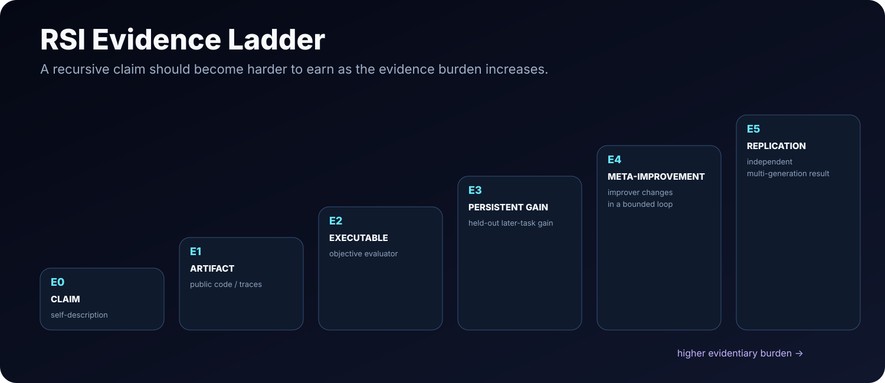

# RSI Scorecard

> **A conservative evidence layer for self-improving AI.** The scorecard rewards evidence, not branding.

[← Observatory](README.md) · [Methodology](METHODOLOGY.md) · [Landscape](LANDSCAPE.md) · [Benchmarks](BENCHMARKS.md)

## Snapshot

| System | Role | Scope | Depth | Persistent | Loop | Improver mutable? | Evidence | Confidence |
|---|---|---|---|---|---|---|---|---|
| [Darwin Gödel Machine](https://github.com/jennyzzt/dgm) | Direct RSI | Harness / agent source code | L4 | yes | closed (bounded) | yes | E4 | medium |
| [Gödel Agent](https://github.com/Arvid-pku/Godel_Agent) | Direct RSI | Harness / agent code | L4 | yes | closed (bounded) | yes | E4 | medium |
| [OpenRSI / OpenMLE](https://github.com/FrontisAI/OpenRSI) | RSI-directed meta-evolution | Model + harness + trainer | L4-like framing; recursion unverified | yes | closed (bounded domain) | trained improver; autonomous meta-loop unverified | E3 | medium |
| [Recuris](https://github.com/Gen-Verse/Recuris) | Self-improving system | Data system / memory + harness | L3 | yes | closed | not demonstrated | E3 | high |
| [Prime Agent](https://github.com/PrimeIntellect-ai/prime-agent) | Self-improving system | Harness / skills / coding workflow | L3-like | yes | refinement available; trigger-dependent | not demonstrated | E1 | medium |
| [KnowAct](https://github.com/HITsz-TMG/KnowAct) | Self-improving system | Data system + harness | L3-like | yes | closed | not demonstrated | E2 | medium |
| [Reflexion](https://arxiv.org/abs/2303.11366) | Enabling / self-improving memory | Data system / memory | L3 | across task trials | closed (task-level) | no | E2 | high |
| [The AI Scientist](https://github.com/SakanaAI/AI-Scientist) | Adjacent AI R&D | Research process | Not RSI-scored | research artifacts, not self-update | closed research workflow | no | E2 | high |
| [LightRSI](https://github.com/zjunlp/LightRSI) | RSI substrate | Harness / runtime | N/A (substrate) | N/A | N/A | score instantiated loop | E1 | high |

### Why these labels are stricter than project names

- The 2026 *Path to Recursive Self-Improving Agents* survey grades **Gödel Agent** and **Darwin Gödel Machine** at **L4**.
- **OpenRSI** explicitly describes its current starting point as **bounded Meta-Evolution — training the improver itself — without claiming general RSI is solved**.
- A project described as “self-improving” is therefore not automatically Direct RSI here. L3-style persistent improvement and L4-style recursive improvement are separated.
- Runtimes such as **LightRSI** are substrates. A runtime does not inherit the capability score of every loop that might be built with it.

## Sources and review limits

Reviewed 2026-09-10. Scores describe public evidence; none of these experiments was independently reproduced by RSI Observatory. Confidence concerns classification, not a replication guarantee. E4 does not establish accelerating or general RSI.

**Darwin Gödel Machine** — The 2026 self-improving-agent survey grades DGM L4; public code evolves the agent implementation and retains empirically validated variants. L4 is survey-aligned; E4 is an editorial reading of author-reported self-modification, not an isolated measurement of accelerating improvement or independent replication. [Source 1](https://github.com/jennyzzt/dgm) · [Source 2](https://arxiv.org/abs/2505.22954) · [Source 3](https://github.com/D2I-ai/awesome-recursive-self-improving-agents)

**Gödel Agent** — The 2026 survey grades Gödel Agent L4; the agent is explicitly self-referential and can rewrite its own logic. L4 is survey-aligned; E4 is an editorial reading of author-reported self-modification, not an isolated measurement of accelerating improvement or independent replication. [Source 1](https://github.com/Arvid-pku/Godel_Agent) · [Source 2](https://arxiv.org/abs/2410.04444) · [Source 3](https://github.com/D2I-ai/awesome-recursive-self-improving-agents)

**OpenRSI / OpenMLE** — Authors report operator training and held-out transfer, and frame this as bounded meta-evolution. The reviewed sources do not establish autonomous repeated modification of the training/update mechanism; E4 is withheld. [Source 1](https://github.com/FrontisAI/OpenRSI) · [Source 2](https://arxiv.org/abs/2607.28568)

**Recuris** — Execution evidence drives persistent memory/harness updates; public evidence does not require the update mechanism itself to be mutable. [Source 1](https://github.com/Gen-Verse/Recuris) · [Source 2](https://arxiv.org/abs/2608.24876)

**Prime Agent** — The README documents durable supplemental harness state, a /refine operation and rollback. The base prompt is immutable. An improvement-specific executable evaluation was not established in this review. [Source 1](https://github.com/PrimeIntellect-ai/prime-agent)

**KnowAct** — The repository documents a Know–Route–Act–Reflect workflow, retained knowledge/skills and benchmark trajectories. This supports an executable GUI agent, without establishing recursive modification of its improver. [Source 1](https://github.com/HITsz-TMG/KnowAct)

**Reflexion** — Reflective text persists across subsequent trials; model weights and the updater stay fixed. Task-level gains alone do not establish retained improvement on fresh held-out tasks, so E3 is withheld. [Source 1](https://arxiv.org/abs/2303.11366)

**The AI Scientist** — Released research workflows and evaluation code support E2. Research artifacts persist, but this does not establish held-out gains caused by persistent changes to the research agent itself. [Source 1](https://github.com/SakanaAI/AI-Scientist)

**LightRSI** — A runtime for deploying RSI loops should not receive capability checkmarks by itself; the instantiated system must be evaluated. [Source 1](https://github.com/zjunlp/LightRSI)

[Full review scope](SOURCE_REVIEW.md).

## What changes a score?

Useful evidence includes:

- a released implementation exposing the self-modification path;
- an executable evaluator, hidden/held-out test, or formal verifier;
- later-task gains caused by retained changes rather than extra test-time compute;
- a mutable search/update/evaluator mechanism;
- multiple generations of improvement without manual patching;
- independent reproduction.

## Machine-readable source

[`data/scorecard.json`](data/scorecard.json) is the source used by the website. Classification disputes should use the repository's correction Issue template.

> **Policy:** under-claim by default. A missing “yes” is not a negative judgment of a project; it means the required public evidence was not found or was not yet independently clear.
